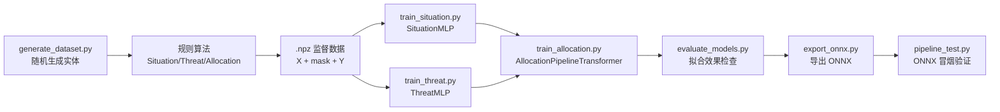

# Version1 离线说明报告

本文档用于把 `Version1` 代码整体带到离线断网环境后，快速理解、排错、修改和部署。建议离线运行所有命令前先进入 `Version1` 目录：

```powershell
cd E:\项目\612_DDXT\CoreCode\Version1
```

## 1. 总体结论

`Version1` 是一个“规则算法生成标签 + 神经网络拟合规则 + ONNX 离线部署”的工程。

当前实体规模由 `shape_config.py` 固定：

| 实体 | 常量 | 当前值 | 数据生成范围 |
| --- | --- | ---: | --- |
| 导弹 | `M_MAX` | 4 | 1 到 4 |
| 友方飞机 | `A_MAX` | 4 | 1 到 4 |
| 敌方目标/敌机 | `T_MAX` | 8 | 1 到 8 |

注意：`generate_dataset.py` 是在这些范围内随机采样，不是穷举所有组合。如果需要保证每一种 `(导弹数, 友机数, 敌机数)` 都出现，需要额外写组合覆盖逻辑。

## 2. 文件职责

| 文件 | 职责 |
| --- | --- |
| `shape_config.py` | 全局固定形状和缩放常量。修改实体数量上限时必须从这里开始。 |
| `dto.py` | 业务 DTO 和实体数据结构，负责输入校验、字典到实体的兼容转换、输出结构化。 |
| `SituationAssessment.py` | Python/NumPy 规则版态势评估，输出导弹-目标态势矩阵 `Y_S`。 |
| `ThreatAssessment.py` | Python/NumPy 规则版威胁评估，输出友机-目标威胁矩阵 `Y_Threat` 和目标威胁权重 `Y_ThreatW`。 |
| `TargetAllocation.py` | Python/NumPy 规则版目标分配，输出每枚导弹选择的目标索引。 |
| `generate_dataset.py` | 随机场景生成器，调用三类规则算法生成监督学习数据 `.npz`。 |
| `dataset.py` | PyTorch Dataset，读取 `.npz` 并校验所有数组形状。 |
| `train_situation.py` | 训练态势评估 MLP，拟合规则算法 `Y_S`。 |
| `train_threat.py` | 训练威胁评估 MLP，拟合 `Y_Threat`，并由预测威胁矩阵派生 `ThreatW`。 |
| `train_allocation.py` | 训练目标分配 Transformer，组合态势模型、威胁模型和分配核心。 |
| `evaluate_models.py` | 评估三个模型对规则算法标签的拟合效果。 |
| `export_onnx.py` | 导出单模型和端到端 pipeline 的 ONNX。 |
| `pipeline_test.py` | 用固定 demo 场景做 ONNX 端到端冒烟验证。 |
| `test_version1_migration.py` | 回归测试：验证向量化规则公式、DTO 接口、边界输入和 shape 校验。 |
| `命令.md` | 当前训练、评估、导出的命令备忘。 |

## 3. 主流程



## 4. 固定形状约定

`shape_config.py` 当前配置：

```python
M_MAX = 4
A_MAX = 4
T_MAX = 8
FEATURE_DIM = 6

POSITION_SCALE = 50_000.0
VELOCITY_SCALE = 2_000.0
```

每个实体输入特征都是 6 维：

```text
[x, y, z, vx, vy, vz]
```

生成后的 `.npz` 数据包含这些数组，设样本数为 `N`：

| key | shape | dtype/含义 |
| --- | --- | --- |
| `X_missile` | `[N, 4, 6]` | 导弹特征，padding 位为 0 |
| `X_aircraft` | `[N, 4, 6]` | 友方飞机特征，padding 位为 0 |
| `X_target` | `[N, 8, 6]` | 敌方目标特征，padding 位为 0 |
| `mask_M` | `[N, 4]` | 真实导弹为 1，padding 为 0 |
| `mask_A` | `[N, 4]` | 真实友机为 1，padding 为 0 |
| `mask_T` | `[N, 8]` | 真实目标为 1，padding 为 0 |
| `Y_S` | `[N, 4, 8]` | 规则态势评估标签 |
| `Y_Threat` | `[N, 4, 8]` | 规则威胁评估标签 |
| `Y_ThreatW` | `[N, 8]` | 按目标归一化后的威胁权重 |
| `Y_AllocIndex` | `[N, 4]` | 每枚有效导弹的目标索引，0 开始 |
| `Y_AllocMask` | `[N, 4]` | 有效导弹标签 mask |

`Y_AllocIndex` 对 padding 导弹默认可能是 0，但必须结合 `Y_AllocMask` 使用。`Y_AllocMask=0` 的位置不参与训练和评估。

## 5. 数据生成逻辑

入口是 `generate_dataset.py`。

每条样本执行 `generate_one_scenario(rng)`：

1. 随机实体数量：

```python
missile_count = int(rng.integers(1, M_MAX + 1))
aircraft_count = int(rng.integers(1, A_MAX + 1))
target_count = int(rng.integers(1, T_MAX + 1))
```

由于 `numpy.random.Generator.integers` 的上界不包含，所以当前范围正好是：

```text
missile_count: 1..4
aircraft_count: 1..4
target_count: 1..8
```

2. 随机战场中心：

```python
battle_center = rng.uniform(15_000.0, 35_000.0, 3)
```

3. 对导弹、友机、目标分别调用 `generate_random_entities`：

- 30% 概率生成密集编队：先在战场中心附近取编队中心，再给每个实体加 `[-500, 500]` 米偏移。
- 非密集编队时，约 50% 在全局 `[0, 50000]` 内均匀生成位置。
- 其余情况在战场中心附近 `[-15000, 15000]` 米范围生成位置。
- 位置会裁剪到 `[0, 50000]`。
- 速度三轴独立均匀采样 `[-1000, 1000]`。

4. 调用规则算法生成标签：

```python
situation_output = SituationAssessment().compute(...)
threat_output = ThreatAssessment().compute(...)
allocation_output = TargetAllocation().compute(...)
```

5. 把变长实体 padding 到固定形状，同时生成 mask。

6. 把真实区域标签填入左上角，其余 padding 区域保持 0。

## 6. DTO 和实体数据

`dto.py` 的核心类是 `EntityState`。导弹、友方飞机、目标都用同一个结构表达：

```python
EntityState(
    id="m0",
    position=np.array([x, y, z], dtype=np.float64),
    velocity=np.array([vx, vy, vz], dtype=np.float64),
    speed=None,
    euler_angles=np.zeros(3, dtype=np.float64),
)
```

重要行为：

- `position`、`velocity`、`euler_angles` 必须都是 3 维有限数值。
- `speed` 不传时自动等于 `norm(velocity)`。
- 如果传入的 `speed` 和速度模长不一致，会自动以速度模长为准。
- `coerce_entities` 兼容旧版 `dict` 输入，也兼容新的 `EntityState` 输入。

三个主输入 DTO：

| DTO | 输入 |
| --- | --- |
| `SAMInputDTO` | `missiles`, `targets` |
| `ThreatInputDTO` | `our_aircrafts`, `targets` |
| `AllocationInputDTO` | `missiles`, `targets`, `situation_output`, `threat_output` |

## 7. 规则算法说明

### 7.1 态势评估 `SituationAssessment`

输入：`M` 枚导弹和 `T` 个目标。

输出：`situation_matrix`，shape 为 `[M, T]`，取值范围 `[0, 1]`。

每个导弹-目标 pair 计算四类分量：

| 分量 | 默认权重 | 含义 |
| --- | ---: | --- |
| `closing_score` | 0.50 | 接近速度越有利，分数越高 |
| `distance_score` | 0.35 | 距离越近，分数越高 |
| `boresight_score` | 0.10 | 目标是否在导弹速度方向视场内 |
| `energy_score` | 0.05 | 导弹速度和距离共同形成的能量项 |

默认参考值：

- 距离参考 `D_ref = 200000.0`
- 接近速度参考 `V_ref = 1300.0`
- 视场半角 `60` 度，即 `cos(60)=0.5`

如果导弹和目标距离近似为 0，该 pair 直接按满分 1 处理。

### 7.2 威胁评估 `ThreatAssessment`

输入：`A` 架友机和 `T` 个目标。

输出：

- `threat_matrix`：shape `[A, T]`
- `target_threat_weights`：shape `[T]`

每个友机-目标 pair 计算四类分量：

| 分量 | 默认权重 | 含义 |
| --- | ---: | --- |
| `los_score` | 0.40 | 敌方目标速度方向是否指向友机 |
| `distance_score` | 0.30 | 敌方目标距离友机越近越危险 |
| `speed_score` | 0.15 | 敌方目标相对友机速度越高越危险 |
| `height_score` | 0.15 | 目标相对友机的高度差 |

默认参考值：

- 距离参考 `D_ref = 100000.0`
- 杀伤距离 `D_lethal = 50000.0`
- 速度参考 `V_ref = 400.0`
- LOS 中性阈值 `cos_neutral = 0.0`
- LOS 高威胁阈值 `cos_lethal = 0.866`

`target_threat_weights` 的计算方式：

1. 对 `threat_matrix` 按友机维度求平均，得到每个目标的原始威胁值。
2. 如果总和大于 0，则归一化到和为 1。
3. 如果没有友机或总威胁为 0，则退化为有效目标上的均匀分布。

### 7.3 目标分配 `TargetAllocation`

输入：

- `situation_matrix`：`[M, T]`
- `target_threat_weights`：`[T]`

核心公式：

```python
value = 0.99 * situation_matrix + 0.01 * target_threat_weights
normalized = row_softmax(value)
target_index = argmax(normalized, axis=1)
```

当前逻辑是每枚导弹独立选择最大值目标，不做“一目标只能分配一枚导弹”的全局约束。因此多枚导弹可以同时选择同一个目标。

当目标数为 0 时会输出 `UNASSIGNED`；但当前数据生成器保证 `target_count >= 1`，训练数据里不会生成无目标样本。

## 8. 神经网络模型

### 8.1 `SituationMLP`

文件：`train_situation.py`

输入：

```text
x_missile [B, 4, 6]
x_target  [B, 8, 6]
mask_m    [B, 4]
mask_t    [B, 8]
```

输出：

```text
S_pred    [B, 4, 8]
joint_mask_MT [B, 4, 8]
```

模型在每个导弹-目标 pair 上构造 10 维特征：

```text
rel_pos(3), rel_vel(3), distance(1), closing_speed(1), boresight_cos(1), missile_speed(1)
```

训练损失是 masked MSE，只在真实导弹和真实目标组成的 pair 上计算。

### 8.2 `ThreatMLP`

文件：`train_threat.py`

输入：

```text
x_aircraft [B, 4, 6]
x_target   [B, 8, 6]
mask_a     [B, 4]
mask_t     [B, 8]
```

输出：

```text
Threat_pred  [B, 4, 8]
ThreatW_pred [B, 8]
joint_mask_AT [B, 4, 8]
```

模型在每个友机-目标 pair 上构造 13 维特征：

```text
rel_pos(3), aircraft_velocity(3), target_velocity(3), distance(1), los_cos(1), speed_ratio(1), height_delta(1)
```

`ThreatW_pred` 不是独立网络头，而是从 `Threat_pred` 经过 masked mean 和 normalize 得到，目的是和规则版 `ThreatAssessment` 的威胁权重逻辑保持一致。

训练损失：

```text
pair_loss + weight_loss_factor * weight_loss
```

默认 `weight_loss_factor = 1.0`。

### 8.3 `AllocationPipelineTransformer`

文件：`train_allocation.py`

对外输入仍然是原始实体张量：

```text
x_missile, x_aircraft, x_target, mask_m, mask_a, mask_t
```

内部流程：

1. `SituationMLP` 预测 `S_pred`。
2. `ThreatMLP` 预测 `ThreatW_pred`。
3. `AllocationCoreTransformer` 使用 `S_pred + ThreatW_pred` 输出目标 logits。

`AllocationCoreTransformer` 输出：

```text
logits [B, 4, 8]
```

训练时用 `Y_AllocIndex` 做交叉熵分类标签，只在 `Y_AllocMask=1` 的导弹上计算损失和准确率。

默认 `--freeze-upstream=True`，即训练分配模型时冻结前两个模型，只训练分配核心。保存文件只保存 `allocation_core.state_dict()`，所以导出和评估时必须同时提供三个 `.pth`：

- `situation_model.pth`
- `threat_model.pth`
- `allocation_transformer_model.pth`

如果训练时改了 `--d-model`、`--num-heads`、`--num-layers`、`--ff-dim`、`--hidden-dim`，评估和导出时必须传入同样参数，否则加载权重会 shape mismatch。

## 9. 推荐离线前完整命令

以下命令建议都在 `Version1` 目录中执行。

### 9.1 回归测试规则算法

```powershell
python test_version1_migration.py
```

通过时应输出：

```text
Version1 migration regression tests passed.
```

### 9.2 生成训练数据

```powershell
python generate_dataset.py --samples 200000 --seed 42 --output aircombat_data_200k.npz
```

小样本快速测试：

```powershell
python generate_dataset.py --samples 1000 --seed 42 --output quick_test.npz
```

### 9.3 训练态势模型

```powershell
python train_situation.py --data aircombat_data_200k.npz --output situation_model_200k.pth --epochs 50 --batch-size 256
```

### 9.4 训练威胁模型

```powershell
python train_threat.py --data aircombat_data_200k.npz --output threat_model_200k.pth --epochs 50 --batch-size 256
```

### 9.5 训练分配模型

```powershell
python train_allocation.py --data aircombat_data_200k.npz --situation-model situation_model_200k.pth --threat-model threat_model_200k.pth --output allocation_model_200k.pth --epochs 50 --batch-size 256
```

### 9.6 评估模型

```powershell
python evaluate_models.py --data aircombat_data_200k.npz --situation-model situation_model_200k.pth --threat-model threat_model_200k.pth --allocation-model allocation_model_200k.pth --batch-size 256
```

重点看：

- `situation_mse`、`situation_mae`：态势模型拟合误差。
- `threat_mse`、`threat_weight_mse`：威胁模型拟合误差。
- `allocation_core_teacher_top1_acc`：只看分配核心在真实中间标签上的分配准确率。
- `allocation_pipeline_top1_acc`：完整端到端 pipeline 的分配准确率，离线部署时最重要。

如果 `allocation_core_teacher_top1_acc` 高，但 `allocation_pipeline_top1_acc` 低，说明分配核心本身可以，主要问题在前面的态势/威胁模型误差传递。

如果两个准确率都低，优先检查分配模型训练轮数、数据量、学习率和模型超参数。

### 9.7 导出 ONNX

```powershell
python export_onnx.py --situation-model situation_model_200k.pth --threat-model threat_model_200k.pth --allocation-model allocation_model_200k.pth --output-dir .
```

默认导出四个文件：

| ONNX 文件 | 作用 |
| --- | --- |
| `situation_model.onnx` | 单独态势模型 |
| `threat_model.onnx` | 单独威胁模型 |
| `allocation_model.onnx` | 原始输入到分配结果，输出 logits/index/mask |
| `version1_aircombat_pipeline.onnx` | 端到端模型，额外输出中间 `S/Threat/ThreatW` |

### 9.8 ONNX 冒烟验证

```powershell
python pipeline_test.py --onnx version1_aircombat_pipeline.onnx
```

该脚本会：

1. 构造固定 demo 场景。
2. 跑 Python 规则算法得到业务分配结果。
3. 把同一组实体 padding 成 ONNX 输入。
4. 跑 ONNX，检查输出目标索引是否落在真实目标范围内。

注意：该脚本需要 `onnxruntime`。如果离线环境没有安装，会提示跳过 ONNX 推理。

## 10. ONNX 输入输出约定

所有 ONNX 只允许 batch 维动态，实体数量维固定：

```text
X_missile [B, 4, 6]
X_aircraft [B, 4, 6]
X_target [B, 8, 6]
mask_M [B, 4]
mask_A [B, 4]
mask_T [B, 8]
```

`version1_aircombat_pipeline.onnx` 输出：

```text
S_pred           [B, 4, 8]
Threat_pred      [B, 4, 8]
ThreatW_pred     [B, 8]
allocation_index [B, 4]
allocation_mask  [B, 4]
```

部署时必须遵守：

1. 真实实体放在数组前部。
2. 不足最大数量的位置填 0。
3. 对应 mask 真实实体为 1，padding 为 0。
4. 读取 `allocation_index` 时只使用 `allocation_mask=1` 的导弹位置。
5. 如果某个 padding 导弹位置输出了目标 0，不代表真实分配，必须忽略。

## 11. 离线环境需要带走的内容

完整训练/评估/导出环境建议带：

```text
Version1/
aircombat_data_200k.npz
situation_model_200k.pth
threat_model_200k.pth
allocation_model_200k.pth
situation_model.onnx
threat_model.onnx
allocation_model.onnx
version1_aircombat_pipeline.onnx
Python 安装包或离线环境
依赖 wheel 包
```

依赖按用途分：

| 用途 | 依赖 |
| --- | --- |
| 运行规则算法、生成数据 | `numpy` |
| 训练、评估、导出 | `numpy`, `torch`, `onnx` |
| ONNX 推理测试/部署 | `numpy`, `onnxruntime` |

CPU 离线包通常需要准备：

```text
numpy
torch
onnx
onnxruntime
```

如果离线环境使用 GPU，需要提前准备与系统 CUDA/驱动匹配的 PyTorch wheel。只做 ONNX CPU 推理时不需要 PyTorch。

## 12. 常见问题和处理

### 12.1 `ModuleNotFoundError: No module named 'dataset'`

原因：脚本使用的是同目录直接导入，例如 `from dataset import AirCombatDataset`。

处理：进入 `Version1` 目录再运行，或设置 `PYTHONPATH` 指向 `Version1`。

```powershell
cd E:\项目\612_DDXT\CoreCode\Version1
python train_situation.py ...
```

### 12.2 `.npz` 缺 key 或 shape mismatch

原因通常是：

- 数据不是由当前 `generate_dataset.py` 生成。
- 修改过 `shape_config.py` 后没有重新生成数据。
- 训练/评估/导出时混用了不同版本的 `shape_config.py`。

处理：重新生成数据，并重新训练、评估、导出。

### 12.3 加载 `.pth` 报 size mismatch

原因：训练和评估/导出时模型超参数不一致。

重点检查：

- `--hidden-dim`
- `--situation-hidden-dim`
- `--threat-hidden-dim`
- `--d-model`
- `--num-heads`
- `--num-layers`
- `--ff-dim`

处理：用训练时完全相同的参数运行 `evaluate_models.py` 和 `export_onnx.py`。

### 12.4 ONNX 输入维度错误

原因：ONNX 中 `M_MAX/A_MAX/T_MAX/FEATURE_DIM` 是固定的，只有 batch 维动态。

处理：输入必须 padding 到：

```text
X_missile [B, 4, 6]
X_aircraft [B, 4, 6]
X_target [B, 8, 6]
```

同时提供对应 mask。

### 12.5 分配结果里 padding 导弹也有目标索引

这是正常现象。`argmax` 对每个固定导弹槽都会输出一个索引。业务使用时必须看 `allocation_mask` 或 `mask_M`。

只处理：

```text
allocation_mask[b, missile_index] == 1
```

### 12.6 想扩大导弹/友机/敌机数量

例如想改成导弹最多 6、友机最多 6、敌机最多 12：

1. 修改 `shape_config.py`：

```python
M_MAX = 6
A_MAX = 6
T_MAX = 12
```

2. 重新生成 `.npz` 数据。
3. 重新训练三个模型。
4. 重新评估。
5. 重新导出 ONNX。
6. 部署端同步新 ONNX 和新输入 shape。

不能只改 ONNX 输入数组大小，因为模型权重和网络层维度也依赖这些固定上限。

### 12.7 修改规则公式后要做什么

如果改了 `SituationAssessment.py`、`ThreatAssessment.py` 或 `TargetAllocation.py`：

1. 跑 `python test_version1_migration.py`，必要时同步更新测试中的参考公式。
2. 重新生成训练数据。
3. 重新训练三个模型。
4. 重新评估。
5. 重新导出 ONNX。
6. 跑 `pipeline_test.py`。

原因：神经网络学习的是规则算法生成的标签，规则改了，旧数据和旧模型都不再对应新业务逻辑。

## 13. 修改指南

### 13.1 只想增加训练样本

不改代码，直接重新生成更大数据：

```powershell
python generate_dataset.py --samples 500000 --seed 42 --output aircombat_data_500k.npz
```

然后重新训练、评估、导出。

### 13.2 想让随机数据严格覆盖全部数量组合

当前是随机采样，不保证所有组合必定出现。若要严格覆盖，可以在 `generate_dataset.py` 里新增一个按组合循环的生成入口：

```text
for missile_count in 1..M_MAX:
  for aircraft_count in 1..A_MAX:
    for target_count in 1..T_MAX:
      每个组合生成 K 条随机位置/速度样本
```

这样当前配置下一共有：

```text
4 * 4 * 8 = 128 种数量组合
```

如果每种组合生成 1000 条，总样本就是 128000 条。

### 13.3 想改输入特征

当前模型特征维度来自实体原始输入 `[x,y,z,vx,vy,vz]`，以及训练脚本内部构造的 pair 特征。

如果要给实体增加特征，例如航向角、雷达反射面积、弹药类型等，需要同步修改：

1. `shape_config.py` 的 `FEATURE_DIM`
2. `generate_dataset.py` 的 `pad_entities`
3. `dataset.py` 的 shape 校验
4. `train_situation.py` 和 `train_threat.py` 的特征构造
5. 如影响分配逻辑，则修改 `train_allocation.py`
6. 重新生成数据、训练、导出

### 13.4 想改分配策略

规则版分配在 `TargetAllocation.py`，模型版分配在 `train_allocation.py`。

如果只是改业务标签，例如权重从 `0.99/0.01` 改成 `0.9/0.1`，需要：

1. 修改 `TargetAllocation.py`
2. 重新生成数据
3. 重新训练分配模型，通常也建议重新评估完整 pipeline

如果想加入“一目标最多分配一枚导弹”的全局约束，则当前 `argmax per row` 策略不够，需要把规则标签生成改成全局匹配算法，例如匈牙利算法或贪心匹配，并同步训练目标。

## 14. 离线部署最小路径

如果离线环境只需要跑推理，不需要训练：

1. 带走 `version1_aircombat_pipeline.onnx`。
2. 带走一份输入预处理代码，逻辑等价于 `generate_dataset.py` 里的 `build_fixed_inputs`。
3. 安装 `numpy` 和 `onnxruntime`。
4. 按固定 shape 构造输入。
5. 调用 ONNXRuntime：

```python
import numpy as np
import onnxruntime as ort

session = ort.InferenceSession("version1_aircombat_pipeline.onnx")

inputs = {
    "X_missile": x_missile.astype(np.float32),  # [B, 4, 6]
    "X_aircraft": x_aircraft.astype(np.float32),  # [B, 4, 6]
    "X_target": x_target.astype(np.float32),  # [B, 8, 6]
    "mask_M": mask_m.astype(np.float32),  # [B, 4]
    "mask_A": mask_a.astype(np.float32),  # [B, 4]
    "mask_T": mask_t.astype(np.float32),  # [B, 8]
}

s_pred, threat_pred, threat_w_pred, allocation_index, allocation_mask = session.run(None, inputs)
```

业务侧只读取 `allocation_mask == 1` 的位置。

## 15. 离线前检查清单

带走前建议确认：

- `python test_version1_migration.py` 能通过。
- 训练数据 `.npz` 能被 `AirCombatDataset` 正常读取。
- 三个 `.pth` 文件和训练超参数记录一致。
- `evaluate_models.py` 输出的 `allocation_pipeline_top1_acc` 达到可接受水平。
- `export_onnx.py` 成功导出四个 ONNX。
- `pipeline_test.py` 能跑通，且没有无效目标索引。
- 离线环境有对应 Python、依赖 wheel、ONNXRuntime。
- 部署端输入严格 padding 到 `[4,4,8]` 的实体上限，并正确使用 mask。

